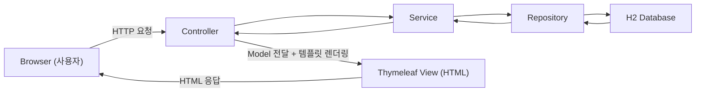
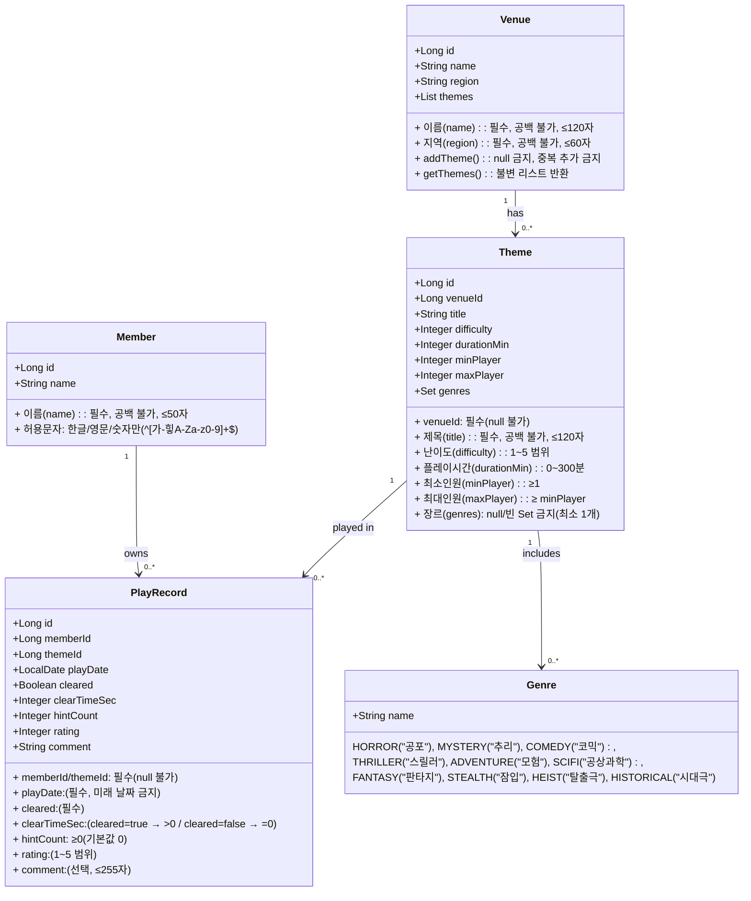

# Escapelog - 방탈출 기록 & 분석 서비스
사용자가 방문한 방탈출 카페/테마 기록하고, 통계를 기반으로 취향을 분석할 수 있는 웹 서비스입니다.
Spring Boot 기반의 백엔드와 Thymeleaf 기반의 서버 렌더링 구조로 구현되었습니다.

---
## 목차
1. 프로젝트 소개
2. 주요 기능
3. 기술 스택
4. 시스템 아키텍처
5. ERD
6. 기능 상세
7. 예외 처리 
8. 폴더 구조 
9. 개선 사항 & 향후 계획

---
## 1. 프로젝트 소개
Escapelog는 방탈출 매니아들을 위한 개인 기록 관리 서비스입니다.
매장/테마별 후기, 플레이 기록, 클리어 여부 등 다양한 정보를 저장하고, 검색/정렬/필터링 등 다양한 조회 기능을 제공합니다.

---
## 2. 주요 기능

### 회원 기능
- 회원가입 / 로그인
- 로그인 ID,닉네임 중복 검증
- 로그인 실패(비밀번호 오류, 존재하지 않는 ID) 처리

### 매장(Venue) 기능
- 매장 등록
- 매장 목록 조회
- 매장명 검색
- 이름순 정렬

### 테마(Theme) 기능
- 테마 등록
- 테마 목록 조회
- 테마명 검색
- 매장명 검색
- 장르 필터링
- 난이도 정렬(높은순/낮은순)

### 후기(PlayRecord) 기능
- 후기 등록
- 후기 목록 조회
- 테마명 검색
- 매장명 검색
- 날짜 정렬(최신순/오래된순)

### 예외 처리
- BaseException 기반 글로벌 예외 처리
- 도메인, 서비스별 커스텀 예외 처리

---
## 3. 기술 스택
### Backend
- Java 21
- Spring Boot 3.5.7
- Spring MVC
- Spring Data JPA
- Bean Validation

### View(SSR)
- Thymeleaf
- Spring MVC Model 기반 서버 사이드 렌더링

### DataBase
- H2 DataBase(file mode)

### Testing
- Spring Boot Starter Test
- JUnit 5
---
## 4. 시스템 아키텍처



---
## 5. ERD


---
## 6. 기능 상세
### 회원(Member)
- 회원가입 시 로그인 ID, 닉네임 중복 검증
- 로그인 실패 시 null 반환 방식으로 에러 처리
- 검증 실패 시 BaseException 기반 커스텀 예외 발생
### 매장(Venue)
- keyword를 통한 매장명, 지역 검색 기능
- sort=nameAsc/nameDesc를 통한 이름순 정렬
### 테마(Theme)
- keyword를 통한 테마명, 매장명 검색 기능
- sort를 통한 난이도순 정렬 
- 장르 기반 필터링
### 후기(PlayRecord)
- keyword를 통한 테마명, 매장명 검색 기능
- sort를 통한 날짜순 정렬

## 7. 예외 처리

프로젝트는 `BaseException` + `GlobalExceptionHandler` 구조로 공통 예외를 처리합니다.

### ✔ 예외 처리 방식
- 도메인/서비스에서 발생한 예외를 하나의 공통 핸들러에서 처리
- `status`, `errorCode`, `message` 로 구성된 공통 에러 DTO 반환
- 공통 예외 페이지(`error/customError`)로 일관된 UI 제공
- 입력값 검증 실패는 해당 페이지를 즉시 재렌더링하여 사용자 경험 유지

### ✔ 에러 코드 구조
예외는 모두 다음 3가지를 가진다.
- HTTP 상태 코드
- 에러 코드 (예: MEMBER-001, THEME-004)
- 사용자 메시지

`getMessage()`를 override 하여 ErrorCode 기반 메시지가 항상 반영되도록 구성.

### ✔ 에러 코드 구분
- **도메인 예외**: 엔티티 유효성 검증 (ID/비밀번호 규칙, 테마 난이도 범위 등)
- **서비스 예외**: 존재하지 않는 회원/매장/테마, 중복 ID, 로그인 실패 등 비즈니스 오류

중복되는 `*_NOT_FOUND` 오류는 하나로 통합해 유지보수성을 높였습니다.

---
## 8. 폴더 구조
```
src
├── main
│   ├── java
│   │   └── com
│   │       └── seonggyun
│   │           └── escapelog
│   │               ├── EscapelogApplication.java
│   │               ├── common
│   │               │   ├── BaseException.java
│   │               │   ├── ErrorCode.java
│   │               │   ├── ErrorResponseDto.java
│   │               │   └── GlobalExceptionHandler.java
│   │               ├── controller
│   │               │   ├── DashboardController.java
│   │               │   ├── HomeController.java
│   │               │   ├── LoginController.java
│   │               │   ├── PlayRecordController.java
│   │               │   ├── SignUpController.java
│   │               │   ├── ThemeController.java
│   │               │   └── VenueController.java
│   │               ├── domain
│   │               │   ├── Genre.java
│   │               │   ├── member
│   │               │   │   ├── Member.java
│   │               │   │   └── exception
│   │               │   │       ├── MemberErrorCode.java
│   │               │   │       └── MemberException.java
│   │               │   ├── playRecord
│   │               │   │   ├── PlayRecord.java
│   │               │   │   └── exception
│   │               │   │       ├── PlayRecordErrorCode.java
│   │               │   │       └── PlayRecordException.java
│   │               │   ├── theme
│   │               │   │   ├── Theme.java
│   │               │   │   └── exception
│   │               │   │       ├── ThemeErrorCode.java
│   │               │   │       └── ThemeException.java
│   │               │   └── venue
│   │               │       ├── Venue.java
│   │               │       └── exception
│   │               │           ├── VenueErrorCode.java
│   │               │           └── VenueException.java
│   │               ├── form
│   │               │   ├── DashBoardDto.java
│   │               │   ├── MemberSignUpForm.java
│   │               │   ├── PlayRecordForm.java
│   │               │   ├── ThemeForm.java
│   │               │   └── VenueForm.java
│   │               ├── repository
│   │               │   ├── MemberRepository.java
│   │               │   ├── PlayRecordRepository.java
│   │               │   ├── ThemeRepository.java
│   │               │   └── VenueRepository.java
│   │               └── service
│   │                   ├── member
│   │                   │   ├── MemberService.java
│   │                   │   └── exception
│   │                   │       ├── MemberServiceErrorCode.java
│   │                   │       └── MemberServiceException.java
│   │                   ├── playRecord
│   │                   │   ├── PlayRecordService.java
│   │                   │   └── exception
│   │                   │       ├── PlayRecordServiceErrorCode.java
│   │                   │       └── PlayRecordServiceException.java
│   │                   ├── theme
│   │                   │   ├── ThemeService.java
│   │                   │   └── exception
│   │                   │       ├── ThemeServiceErrorCode.java
│   │                   │       └── ThemeServiceException.java
│   │                   └── venue
│   │                       ├── VenueService.java
│   │                       └── exception
│   │                           ├── VenueServiceErrorCode.java
│   │                           └── VenueServiceException.java
│   └── resources
│       ├── application.yml
│       ├── static
│       │   ├── css
│       │   │   ├── bootstrap.min.css
│       │   │   └── custom.css
│       │   └── js
│       │       └── bootstrap.bundle.min.js
│       └── templates
│           ├── dashboard.html
│           ├── error
│           │   └── customError.html
│           ├── fragments
│           │   ├── bodyHeader.html
│           │   ├── dashboardHeader.html
│           │   ├── footer.html
│           │   └── header.html
│           ├── home.html
│           ├── login
│           │   ├── login.html
│           │   └── signup.html
│           ├── playRecordPages
│           │   ├── createPlayRecord.html
│           │   └── playRecordList.html
│           ├── themePages
│           │   ├── createTheme.html
│           │   └── themeList.html
│           └── venuePages
│               ├── createVenue.html
│               └── venueList.html
└── test
    └── java
        └── com
            └── seonggyun
                └── escapelog
                    ├── EscapelogApplicationTests.java
                    ├── domain
                    │   ├── GenreTest.java
                    │   ├── MemberTest.java
                    │   ├── PlayRecordTest.java
                    │   ├── ThemeTest.java
                    │   └── VenueTest.java
                    └── service
                        ├── MemberServiceTest.java
                        ├── PlayRecordServiceTest.java
                        ├── ThemeServiceTest.java
                        └── VenueServiceTest.java
```
---
## 9. 개선 사항 & 향후 계획
- 비밀번호 암호화
- 소셜 로그인 사용
- 매장, 테마, 후기 목록 내용 간소화
- 매장, 테마, 후기 상세 페이지 추가